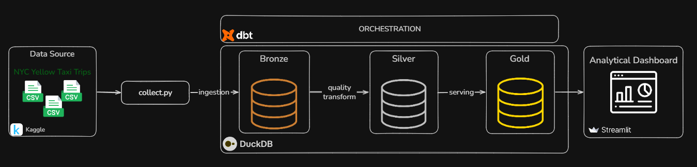
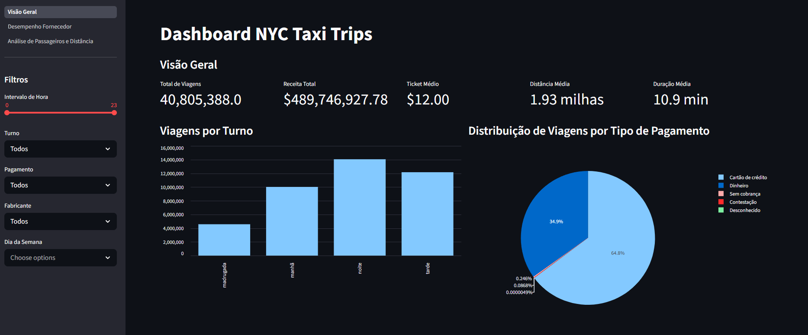
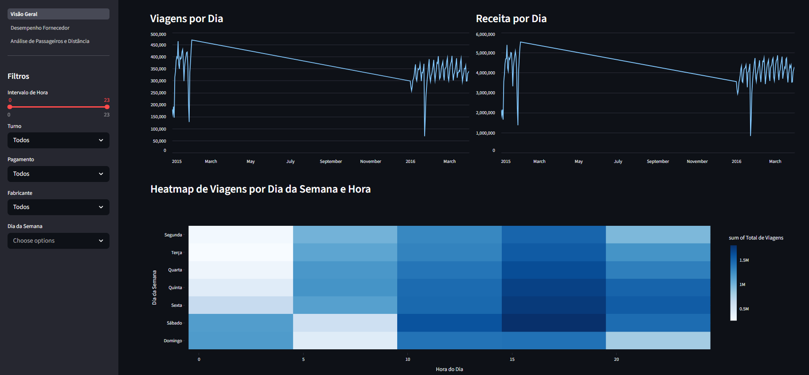
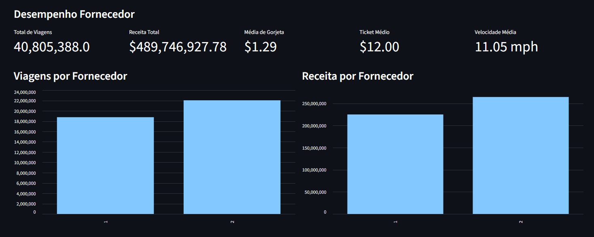
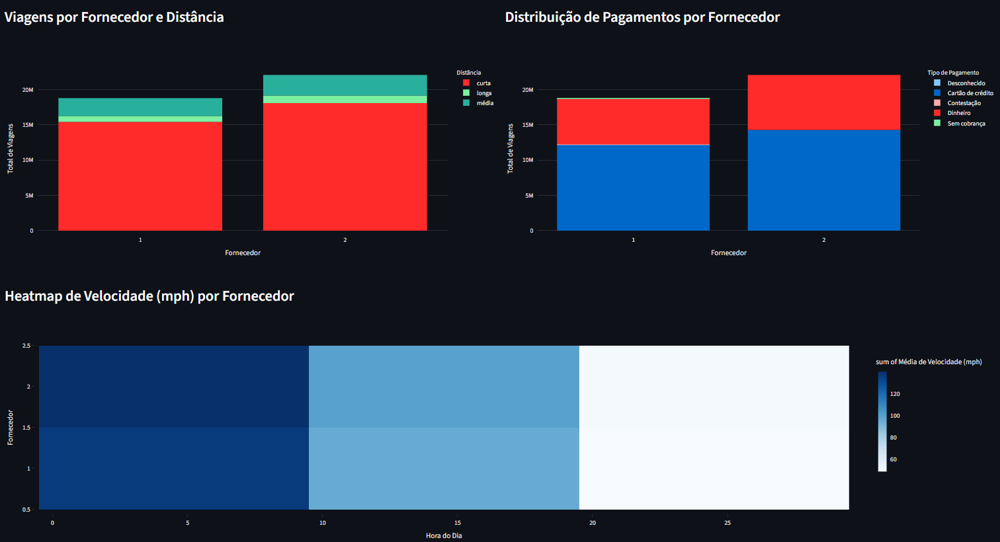
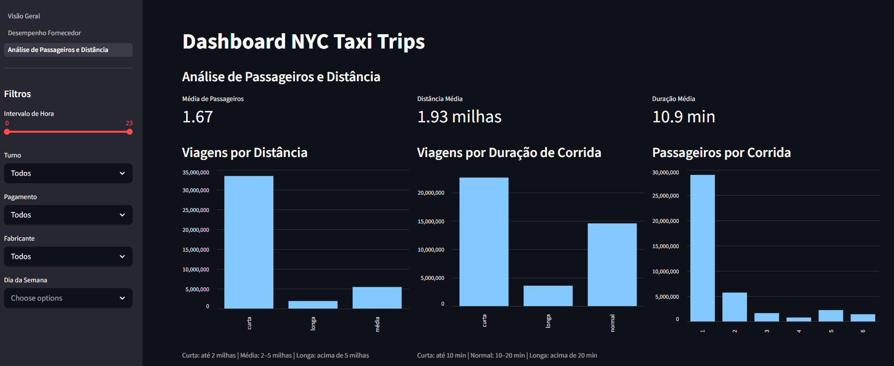
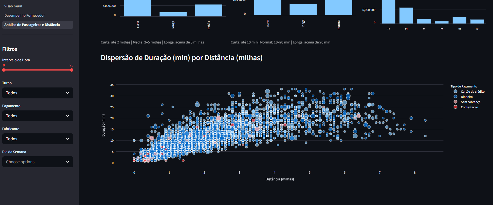

# NYC Taxi Trips

Desafio técnico 02 — ETL Simples com Dados de Táxi de NYC lançado na comunidade [Dados Por Todos](https://www.instagram.com/dadosportodos) com o objetivo de incentivar o aprendizado prático.

Projeto de Engenharia de Dados com a proposta de experienciar na prática todo o processo, desde a extração dos dados brutos até o carregamento dados para criação das análises e dashboards. 

## Tecnologias Utilizadas

- **Kaggle** – Fonte de dados brutos para análise de corridas de táxi, permitindo download e exploração inicial dos datasets.
- **Python** – Linguagem principal para extração de dados e visualização no Streamlit.
- **DuckDB** – Banco de dados analítico embutido, usado para armazenar, consultar e transformar grandes volumes de dados, com alta performance para queries analíticas.
- **DBT** – Ferramenta de transformação de dados, responsável por criar pipelines de limpeza, enriquecimento e agregação, estruturando dados brutos em views organizadas para análises.
- **Streamlit** – Framework para construção de dashboards e aplicações web interativas, consumindo as views do DBT para visualização de KPIs e métricas de desempenho.

## Estrutura do Projeto

O projeto está organizado de forma modular, separando responsabilidades entre ingestão, transformação e consumo dos dados:

```
├── data/
│   └── raw/                     # Arquivos Parquet da camada Bronze
├── ingestion/
│   └── collect.py               # Script de download e preparação dos dados
├── taxi_trips_dbt/
│   ├── models/
│   │   ├── source/              # Camada Bronze
│   │   ├── intermediate/        # Transformações intermediárias
│   │   └── marts/
│   │       ├── core/            # Camada Silver (dados tratados)
│   │       └── analytics/       # Camada Gold (tabela fato)
│   └── dbt_project.yml
├── dashboard/
│   ├── 1_Visão_Geral.py         # Página principal (Visão Geral)
│   └── pages/
│       ├── 2_Desempenho_Fornecedor.py
│       └── 3_Analise_Passageiros_Distancia.py
└── README.md
```

## Etapas do Projeto

- [Arquitetura](#arquitetura)
- [Coleta de Dados](#coleta-de-dados)
- [Validação e Transformação dos Dados](#validação-e-transformação-dos-dados)
- [Dashboard Analítico](#dashboard-analítico)

### Arquitetura

Inicialmente, o pipeline consome os dados brutos do **NYC Yellow Taxi Trips**. Em seguida, a arquitetura segue o modelo **Medallion**, estruturando os dados em três camadas:

- **Bronze**: ingestão e armazenamento dos dados originais.
- **Silver**: aplicação de transformações de qualidade e limpeza, padronizando os dados para análises confiáveis.
- **Gold**: agregações e cálculos finais, preparando os dados para consumo analítico.

O pipeline é orquestrado para garantir a execução sequencial e dependente de cada etapa, assegurando integridade e consistência dos dados.

Por fim, os dados finais são disponibilizados para consumo em dashboards e relatórios, permitindo análises interativas e decisões baseadas em dados confiáveis.



### Coleta de Dados

Os dados desse projeto tem como fonte o conjunto de dados do [NYC Yellow Taxi Trip Data](https://www.kaggle.com/datasets/elemento/nyc-yellow-taxi-trip-data) disponibilizado na plataforma do Kaggle.

Esse dataset contempla os dados para os períodos de **Janeiro de 2015 e Janeiro a Março de 2016**, considerando apenas dados de **Yellow Taxis**.

#### Estratégia de Ingestão

A ingestão foi implementada em **Python**, utilizando a biblioteca **kagglehub** para autenticação e download automatizado dos arquivos.

Os dados são processados seguindo o fluxo:

1. Download dos arquivos `.csv`
2. Leitura e validação estrutural básica
3. Conversão para formato Parquet

Apesar dos dados serem mantidos inalterados, foi aplicado uma conversão dos arquivos de `.csv` para `.parquet`, com o objetivo de melhorar o desempenho de consulta.

#### Armazenamento

Após o processo de ingestão, os dados convertidos para formato Parquet são armazenados localmente no diretório:

```shell
/data/raw/
```

A carga para a camada **Bronze** é realizada via **dbt**, onde os dados são efetivamente materializados como uma tabela física no **DuckDB**. A definição da tabela `bronze_taxi` utiliza a leitura dos arquivos Parquet como fonte.

### Validação e Transformação dos Dados

Com a carga na camada Bronze, na próxima etapa os dados passam por um processo de **tratamento e validação** na camada **Silver**, com o objetivo de garantir consistência, qualidade e padronização.

#### Qualidade dos Dados

A validação da qualidade dos dados é realizada por meio de uma tabela intermediária na qual são aplicadas regras de verificação sobre os dados da camada Bronze.

Para cada regra definida, é criada uma coluna do tipo `flag`, responsável por indicar se o registro atende aos critérios de qualidade estabelecidos. Valores **diferentes de 0** sinalizam violações dessas regras, caracterizando registros potencialmente inválidos.

Dentre as `flags` aplicadas, foram consideradas as seguintes categorias de validação:

- **Valores nulos**
- **Valores inválidos** que violam regras básicas do domínio (ex: valores negativos, zero ou fora de conjuntos permitidos)
- **Outliers** identificados com base em limites lógicos e estatísticos definidos para variáveis numéricas
- **Registros duplicados**

A partir das `flags` individuais, é calculado um score de qualidade por registro, definido como a soma das violações identificadas:

- Cada `flag` ativa (valor = 1) representa uma falha em uma regra de validação
- O `quality_score` corresponde ao total de falhas por linha

Dessa forma:

- `quality_score` = 0 → registro sem inconsistências
- `quality_score` > 0 → presença de uma ou mais violações

Esse score permite uma avaliação quantitativa da qualidade dos dados, sendo utilizado como critério para filtragem na camada Silver.

#### Transformações nos Dados

Na etapa seguinte, é dado início às transformações da camada Silver:

- **Filtragem baseada em qualidade**

    Apenas registros com `quality_score = 0` são mantidos, garantindo que somente dados válidos sejam considerados

- **Padronização de Tipos**

    Conversão de tipos explícita dos tipos de dados de cada coluna para garantir consistência.

- **Enriquecimento dos dados**
 
    Criação de novas colunas derivadas, com foco em agregar nas análises de camada Gold:
    - **Classificação de distância** (curta, média, longa)
    - **Classificação de duração** (curta, normal, longa)
    - **Classificação por turno** (madrugrada, manhã, tarde, noite)
    - **Extração temporal**:
        - hora da viagem
        - dia da semana
        - indicador de final de semana (`is_weekend`)
    - **Métricas derivadas**:
        - receita por minuto
        - receita por milha

### Dashboard Analítico

A camada analítica é suportada por uma tabela fato na camada **Gold**, construída a partir dos dados enriquecidos da Silver.

Essa tabela foi modelada com foco na análise e construção de dashboards, centralizando métricas e dimensões relevantes para o domínio das viagens.

A estrutura do dashboard foi organizada em três visões principais, refletindo diferentes perspectivas de análise:

- Visão Geral
- Desempenho dos Fornecedores
- Análise de Passageiros e Distância

#### Filtros Globais

O dashboard permite a aplicação de filtros dinâmicos que impactam todas as métricas e visualizações, possibilitando análises segmentadas.

Os filtros disponíveis são:

- Intervalo de Hora
- Turno
- Tipo de Pagamento
- Fornecedor (VendorID)
- Dia da Semana

Os filtros são aplicados diretamente nas consultas realizadas pelo Streamlit sobre a tabela fato, garantindo que todas as métricas reflitam o mesmo subconjunto de dados.

#### Visão Geral

Essa seção fornece uma visão consolidada das métricas principais do dataset, permitindo análise rápida do comportamento das corridas ao longo do tempo.

- KPIs:
    - Total de Viagens
    - Receita Total
    - Ticket Médio
    - Distância Média
    - Duração Média
- Visualizações:
    - Volume de Viagens por Turno
    - Distribuição de Viagens por Tipo de Pagamento 
    - Evolução Temporal de Viagens
    - Evolução Temporal da Receita
    - Heatmap de Viagens (dia da semana x hora)




#### Desempenho dos Fornecedores

Segmento dedicado a uma análise do desempenho dos fornecedores, permitindo comparações diretas entre volume, receita e eficiência operacional.

- KPIs:
    - Total de Viagens
    - Receita Total
    - Média de Gorjeta
    - Ticket Médio
    - Velocidade Média
- Visualizações:
    - Volume de Viagens por Fornecedor
    - Volume de Receita por Fornecedor
    - Viagens por Fornecedor e faixa de Distância
    - Distribuição de Pagamentos por Fornecedor
    - Heatmap de Média de Velocidade (fornecedor x hora)




#### Análise de Passageiros e Distância

Nessa visão é apresentado uma análise concentrada na relação entre demanda (passageiros) e características das corridas.

- KPIs:
    - Média de Passageiros
    - Distância Média
    - Duração Média
- Visualizações:
    - Volume de Viagens por Categoria de Distância
    - Volume de Viagens por Categoria de Duração
    - Volume de Viagens por Quantidade de Passageiros
    - Dispersão de Duração (min) por Distância (milhas)


